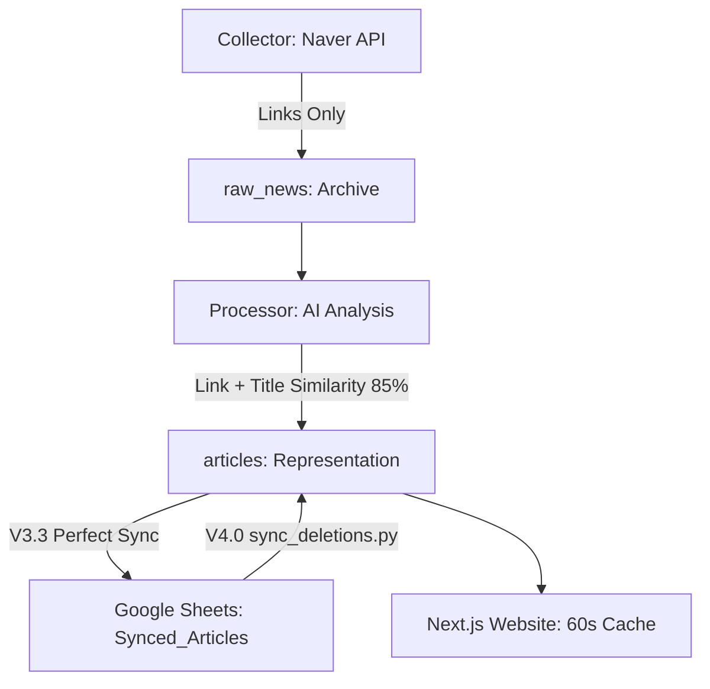

# 📄 뉴스 대시보드 백엔드 가이드라인 (Unified Backend Guidelines)

**Version**: 2.5 (2026-01-01 New Year Update)
**Status**: Stable / Monitoring Active

이 문서는 뉴스 대시보드 프로젝트의 백엔드 아키텍처, 데이터 파이프라인, 태블릿 운영 수칙, 트러블슈팅을 집대성한 공식 매뉴얼입니다.

---

## 🏗️ 1. 시스템 아키텍처 (System Architecture)

### 📡 하이브리드 파이프라인 V4.1 (Hybrid Pipeline)



- **수집 (Collector)**: `async_collector.py`가 네이버 뉴스 검색 API를 통해 기사를 수집합니다. 통계 분석을 위해 **링크 중복만 체크**하고 모든 유사 기사를 `raw_news` 테이블에 보관합니다.
- **분석 (Processor)**: 태블릿(Legion Y700) 내의 `Ollama (Llama 3.2 3B)`가 수집된 기사를 분석하여 **광고 제거, 요약, 핵심 키워드 추출**을 수행합니다. **링크 + 제목 유사도(85%)**를 체크하여 대표 기사만 선별합니다.
- **데이터 우선순위 (V4.1)**: 사용자의 선호에 따라, AI 요약본 대신 **원본 기사 내용(Naver Description)**을 웹페이지와 구글 시트의 기본 요약으로 사용합니다. AI 데이터는 보조 필드(`ai_summary`)에만 보관합니다.
- **저장 (Supabase)**:
  - `raw_news`: 모든 수집 데이터 (통계 분석용 원본)
  - `articles`: 중복 제거된 대표 기사 (웹사이트 표시용)
- **동기화 (V3.3)**: `articles`에 저장 성공한 경우에만 Google Sheets의 **`Synced_Articles`** 탭에 저장됩니다. 완벽한 1:1 동기화가 보장됩니다.
- **삭제 동기화 (V4.0)**: 구글 시트에서 행을 삭제한 후 `sync_deletions.py`를 실행하면 Supabase 데이터도 자동으로 삭제되어 웹사이트에 즉시 반영됩니다.

---

## 🏰 2. 백엔드 핵심 원칙 (Core Principles)

1. **태블릿이 사령관이다 (Tablet First)**: 수집과 분석 프로세스는 태블릿(Termux) 내에서 실행됩니다.
2. **데이터 무결성 (Integrity)**: 한자, 일본어, 특수문자가 포함된 기사는 **즉시 폐기**합니다.
3. **24/7 자율 주행 (Autonomy)**: 에러 발생 시 스스로 재시도하며 로그를 남깁니다.
4. **보안 절대주의 (Security)**: API Key는 `.env`와 **Base64 하드코딩**으로만 관리하며 GitHub 노출을 엄격히 금지합니다.
5. **가이드라인 선행 독해 (Guidelines First)**: 모든 새로운 작업이나 수정 요청을 수행하기 전, 반드시 이 백엔드 가이드라인 및 관련 문서(`_docs/`)를 정독한 후 작업에 착수하십시오. 무지성 자동화보다 중요한 것은 철학의 유지입니다.
6. **DB 자격 증명 (DB Auth)**: 인덱싱 및 관리를 위한 전용 패스워드는 `AISapience111$`을 사용하며, 분실 시 Supabase Dashboard에서 재설정합니다.
7. **로그 맹신 금지 (Never Trust Logs Alone)**: 터미널 로그만 보고 "정상"이라고 판단하지 마십시오. 중복 프로세스나 별도 세션이 있을 수 있습니다.
8. **원격 명령어 주의 (No PowerShell '&&')**: Windows 터미널에서 `&&` 연산자는 버전에 따라 오작동할 수 있습니다. 운영 명령어(Git, SSH 등)는 가급적 하나씩 나누어 실행하거나, 쉘 스크립트 파일로 작성하여 호출하십시오.
9. **삼중 교차 검증 (Triple Cross-Validation)**: 파이프라인 상태 보고 전, 반드시 아래 3곳을 모두 확인하십시오.

### ⚠️ AI 진단 시 필수 검증 체크리스트 (Mandatory Verification)

**"정상 가동 중" 또는 "완료"라고 보고하기 전, 아래 항목을 반드시 확인하십시오.**

| # | 확인 항목 | 명령어/방법 | 정상 기준 |
|---|----------|-------------|-----------|
| 1 | **프로세스 개수** | `ssh ... "pgrep -fl python"` | 정확히 **2개** (collector + processor) |
| 2 | **Supabase articles** | `check_articles.py` 실행 | 오늘 날짜 데이터 존재 |
| 3 | **Google Sheets** | 시트 직접 열어서 확인 | 최신 타임스탬프가 현재 시각과 근접 |
| 4 | **웹사이트** | 배포된 URL 직접 방문 | 오늘 날짜 뉴스 표시 |

**절대 금지 사항**:

- ❌ 로그에 "Queue empty"만 보고 "정상"이라고 판단
- ❌ 프로세스 개수 확인 없이 "재시작 완료" 보고
- ❌ 구글시트만 보고 웹사이트도 됐다고 가정
- ❌ 사용자에게 "완료"라고 말한 후 검증하지 않음

**반드시 지킬 것**:

- ✅ 보고 전 웹사이트를 직접 열어서 눈으로 확인
- ✅ 시트와 Supabase 데이터 개수 비교
- ✅ 프로세스 개수가 2개인지 확인 후 보고

---

## 🧹 3. 데이터 정제 및 보정 (Data Hygiene)

### 🚫 비토종 문자 완전 제거

- **원칙**: 모든 텍스트는 **한국어(한글), 영어, 숫자**만 허용합니다.
- **처리**: 한자(`\u4e00-\u9fff`), 일어 히라가나/가타카나 발견 시 정규식으로 즉시 제거하거나 기사를 폐기합니다.

### 🎯 키워드 분석 및 SSOT (Single Source of Truth)

- **SSOT 원칙**: 모든 키워드 분석은 **`_shared/keywords.json`** 파일을 절대적 기준으로 삼습니다.
- **백엔드 연동**: 분석기(`local_keyword_extractor.py`)는 하드코딩 대신 위 JSON 파일을 실시간 로드하여 화이트리스트 필터링을 수행합니다.

### ✍️ AI 요약문 50자 규칙

- **가이드**: 프론트엔드 카드 UI 최적화를 위해 AI 요약은 **50자 내외(최대 70자)**로 제한합니다.
- **방어 로직**: 요약이 너무 길 경우 백엔드에서 강제 절단하거나 재요약을 요청하여 레이아웃 깨짐을 방지합니다.

---

## 🚀 4. 성능 최적화 및 모니터링 (Performance & Monitoring)

### ⚡ 성능 최적화 (Optimization)

- **DB 인덱스 필수**: Supabase `articles` 테이블의 `published_at` (DESC) 및 `keyword` 컬럼에 인덱스를 생성하여 대량 데이터 처리 속도를 보장합니다.
- **API 캐싱**: 모든 뉴스 조회 API는 `export const revalidate = 60;`을 적용하여 서버 부하를 최소화합니다.
- **응답 압축**: `next.config.js`의 `compress: true` 설정을 통해 클라이언트 전송 데이터를 압축합니다.

### 🚨 에러 모니터링

- **Sentry (Web)**: Next.js 프론트엔드 및 Vercel API 에러를 실시간 추적합니다. (`NEXT_PUBLIC_SENTRY_DSN` - 끝자리 3872)
- **Sentry (Tablet)**: 태블릿의 수집/분석 프로세스 에러를 추적합니다. (`SENTRY_DSN` - 끝자리 1408)
- **자율 주행**: 에러 발생 시 Sentry 보고 후 시스템은 중지되지 않고 30~60초 후 자동 재시도합니다.

---

## 📊 5. 구글 시트 스키마 (Distributed Multi-Sheet System)

**핵심 규칙**: 모든 시트의 데이터는 **최신 항목이 상단(Row 2)**에 오도록 기록해야 합니다.

- **Node.js**: `insertDimension` 요청으로 2행을 삽입한 후, `loadCells/getCell`로 데이터를 채우십시오. (v4 고수준 API의 한계 극복)
- **Python**: `sheet.insert_row(data, 2)`를 사용하여 최신 데이터를 상단에 배치하십시오.

데이터 보안과 관리 효율을 위해 두 개의 독립적인 구글 시트를 운영합니다.

### 📗 1. 사용자 분석 및 로그 시트 (User Operations)

- **ID**: `1wA1YzPatil0qnhZk1EkS4r4Roc-Mx1I-iBSlmtyJNm8` (Logins & Analytics)
- **주요 탭**:

#### 1. 방문자 및 통계

- **`Visits_v2`**: [Time, IP, Country, UserAgent] - 최신순 정렬(Prepend).
- **`DailyStats_v2`**: [Date, TotalVisitors] - 일별 자동 집계.

#### 2. 사용자 활동 (Activity Logs)

- **`LoginHistory_v2`**: [Time, UserID, Type, Meta, IP] - 로그인 및 클릭 로그.
- **`UserCollections_v2`**: [UserID, IP, Title, URL, Date, AddedAt] - 즐겨찾기 통합 관리.

### 📘 2. 시장 분석 시트 (Market Analysis)

- **ID**: `1IDFVtmhu5EtxSacRqlklZo6V_x9aB0WVZIzkIx5Wkic` (Collector Results)
- **주요 탭**:
  - **`Synced_Articles`**: (V3.3 적용) Supabase articles와 1:1 동기화되는 메인 분석 결과 시트. 원본 기사 내용을 포함함.
  - **`Sheet1`**: 기존 데이터 백업용 (Main 탭 아님).
  - **`키워드제안`**: 사용자가 입력한 새로운 시장 키워드 제안서.

---

## 🏗️ 6. 유지보수 및 확장 가이드 (Developer's Note)

### 🏠 터미널 및 파워쉘 수칙 (Strict Terminal Protocol)

- **에러 즉시 정지 (Stop on Error)**: 명령어 실행 시 에러 메시지나 `Exit Code 1`이 발생하면, 다음 명령을 내리지 말고 즉시 멈추어 원인을 분석하십시오.
- **답변 정독**: 터미널이 내비치는 모든 텍스트(Warning, Error, Info)를 정독하여 현재 시스템 상태를 정확히 진단하십시오.
- **환경 검증 우선**: 새로운 스크립트 실행 전, 필요한 라이브러리(`dotenv` 등)나 환경 변수가 세팅되어 있는지 먼저 체크하십시오. (무지성 실행 금지)

### 📡 태블릿 SSH 연결 정보 (Tablet SSH Config)

| 항목 | 값 |
|------|-----|
| **Host** | `192.168.219.102` |
| **Port** | `8022` |
| **User** | `u0_a43` |
| **Password** | `aisapiens` |

```bash
# 빠른 연결 명령어
ssh -p 8022 u0_a43@192.168.219.102

# 로그 확인
ssh -p 8022 u0_a43@192.168.219.102 "tail -50 ~/news_dashboard/processor.log"
ssh -p 8022 u0_a43@192.168.219.102 "tail -50 ~/news_dashboard/collector.log"

# 프로세스 확인
ssh -p 8022 u0_a43@192.168.219.102 "ps aux | grep python"
```

### 🎮 태블릿 원격 제어 수칙 (Strict Remote Protocol)

- **복합 명령어 금지**: SSH를 통한 원격 제어 시 **`&&`나 `;`를 사용하여 명령어를 묶어서 보내지 마십시오.** (명령어 유실 및 실행 순서 보장 방지)
- **단일 명령 & 확인**: 반드시 `git pull`, `pkill`, `start` 등 명령을 **하나씩** 전송하고, 매번 결과(출력 내용 및 Exit Code)를 확인한 후 다음 단계로 넘어가십시오.
- **인터랙티브 대기**: 비밀번호(`aisapiens`) 입력 프롬프트가 뜰 때까지 충분히 대기하고 정확히 입력하십시오.

### 📊 구글 시트 마이그레이션 전략

- 시트 탭이 꼬이거나 쓰기가 거부될 땐 지체 없이 **새 탭(`_v2` 등)**을 생성하여 타겟을 변경하는 것이 가장 빠릅니다.

---

## 🛠️ 7. 오늘의 교훈 및 트러블슈팅 (Lessons Learned)

운영 중 발생한 실제 에러 사례를 바탕으로 한 대응 가이드입니다.

- **PowerShell 구문 주의**: `&&` 연산자는 모든 쉘 환경에서 동일하게 작동하지 않을 수 있으므로 복합 명령을 피하십시오.
- **DDL 권한 제한**: Supabase API Key는 보안상 `CREATE INDEX` 같은 구조 변경 명령이 거부될 수 있습니다. 중요한 DB 구조 변경은 반드시 **Supabase Dashboard의 SQL Editor**에서 실행하십시오.
- **환경변수 파싱**: `.env.local` 파일 내에 JSON 문자열이 포함된 경우, `python-dotenv` 등에서 경고가 발생할 수 있습니다. 이는 무시해도 좋으나 연결 실패 시 가장 먼저 확인하십시오.
- **좀비 프로세스**: `pkill python`으로 프로세스를 죽여도 태블릿에서 살아있는 경우가 있으니 `ps -ef`로 반드시 확인하십시오.
- **서버 시차 (UTC vs KST)**: Vercel 서버는 UTC 기준이므로, 구글 시트 날짜 키(`DateKey`) 생성 시 반드시 `Intl.DateTimeFormat` 등을 사용해 `Asia/Seoul` 타임존을 명시적으로 선언해야 합니다. (자정 업데이트 지연 방지)
- **Sentry DSN 분리**: 웹과 태블릿은 서로 다른 프로젝트 DSN을 사용하므로, 환경 변수(`.env.local` vs `collector/.env`) 설정 시 섞이지 않도록 주의하십시오.

### 📅 2026-01-01 중복 프로세스 사건 (Duplicate Process Incident)

**증상**: 웹사이트에 1월 1일 뉴스가 안 보여서 진단 시작 → `processor.log` 마지막 기록이 12/31 21:39, `collector.log`는 12/31 19:00으로 멈춘 것처럼 보임. 그러나 **구글시트에는 1/1 05:10~14:02의 데이터가 42개 존재**.

**원인**: 태블릿에서 `start_tablet_solo.sh`가 여러 번 실행되어 **6개 이상의 중복 Python 프로세스**가 백그라운드에서 동시에 실행 중이었음. `tail` 명령으로 본 로그는 **현재 세션의 로그 파일 끝부분**이었고, 다른 프로세스들이 별도로 작업 중이었음.

**진단 방법**:

```bash
# 프로세스 개수 확인 (2개여야 정상)
ssh -p 8022 u0_a43@192.168.219.102 "pgrep -fl python"

# 구글시트 수정 이력 확인 (news-bot 서비스 계정이 마지막 수정자)
# 시트 URL > 파일 > 버전 기록
```

**해결**:

```bash
ssh -p 8022 u0_a43@192.168.219.102 "pkill python"
ssh -p 8022 u0_a43@192.168.219.102 "cd ~/news_dashboard && bash start_tablet_solo.sh"
```

**교훈**: 로그만 믿지 말고, **실제 프로세스 개수**와 **구글시트 타임스탬프**를 교차 검증하십시오.

---

> **Note**: 시스템이 멈추거나 이상하면 로그를 확인하기 전에 이 가이드라인을 먼저 읽으십시오. 90%의 정답은 이미 여기에 있습니다.
